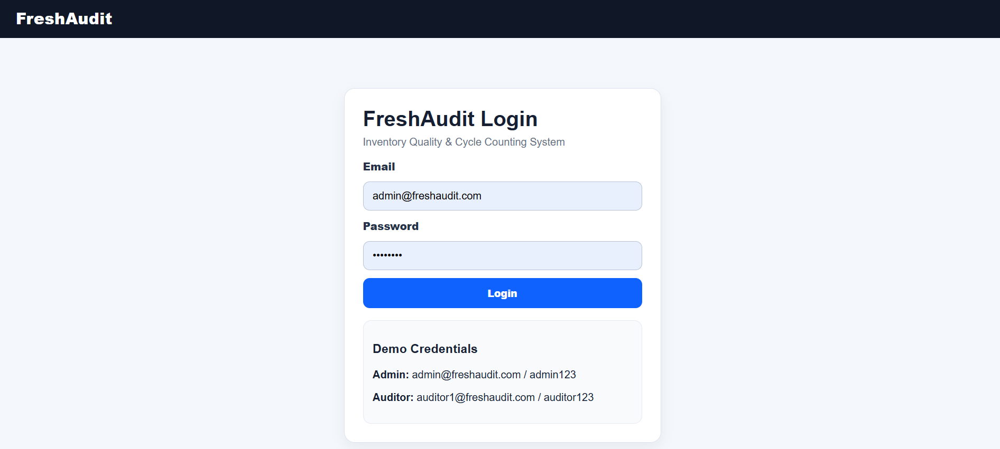

# FreshAudit - Inventory Quality & Cycle Counting System

FreshAudit is a working MVP for an internal logistics application used to schedule blind inventory cycle counts at fulfillment hubs.

## Tech Stack

- Python
- FastAPI
- SQLite for local demo
- SQLAlchemy ORM
- Jinja2 HTML templates
- Session-based login
- CSV report export

## Features Implemented

- Central Admin login
- Hub Auditor login
- Role-based access control
- Auditor-to-warehouse mapping
- Audit task creation
- Frozen inventory snapshot at task activation
- Blind auditor count workflow
- Location barcode input validation
- SKU scan input validation
- Manual physical quantity entry
- Confirmation before final submission
- Submitted counts are locked/read-only
- Audit trail for login, task creation, scan/count events, and report download
- Admin variance report
- CSV download

## Demo Credentials

### Central Admin

Email: admin@freshaudit.com  
Password: admin123

### Hub Auditor

Email: auditor1@freshaudit.com  
Password: auditor123

## How to Run Locally

```bash
python -m venv venv
```

### Windows

```bash
venv\Scripts\activate
```

### Mac/Linux

```bash
source venv/bin/activate
```

Install dependencies:

```bash
pip install -r requirements.txt
```

Run the app:

```bash
python run.py
```

Open:

```text
http://127.0.0.1:8000
```

## Recommended Demo Flow

1. Login as Admin. 
2. Go to Create Audit Task.
3. Select warehouse `WH_BLR_001`.
4. Select target type `LOCATION`.
5. Enter target value `Aisle_B`.
6. Create audit task.
7. Logout.
8. Login as Auditor using `auditor1@freshaudit.com`.
9. Open the assigned audit task.
10. For each row, copy the shown shelf location into location scan, copy shown SKU into SKU scan, and enter physical quantity.
11. Submit count.
12. Logout and login as Admin.
13. Open variance report and download CSV.

## Key Design Decisions

### 1. Frozen Inventory Snapshot

When Central Admin creates an audit task, the system copies matching live inventory rows into `audit_snapshot_lines`. This prevents variance calculations from changing if live inventory changes later.

### 2. Blind Count Enforcement

The auditor UI receives only SKU, item name, and shelf location. It does not receive or display snapshot quantity, expected quantity, variance, or shrinkage rate.

### 3. Warehouse-Level RBAC

Auditor access is checked on the backend using `auditor_warehouse_mappings`. Even if someone changes the URL manually, the backend blocks unauthorized warehouse/task access.

### 4. Immutable Count Submission

After a count is submitted, it is saved with `is_locked=True`. A unique database constraint prevents duplicate count submissions for the same task, SKU, and shelf location.

### 5. Audit Trail

Critical events are logged with timestamp, user ID, audit task ID, warehouse ID, IP address, and device information.

## Variance Report Formula

```text
Variance = audited_quantity - snapshot_quantity
```

```text
Shrinkage Rate = (snapshot_quantity - audited_quantity) / snapshot_quantity * 100
```

If `snapshot_quantity = 0`, shrinkage rate is shown as `N/A` to avoid division by zero.

## Production Improvements

- Replace SQLite with PostgreSQL.
- Move session secret to environment variables.
- Add JWT or enterprise SSO.
- Add Alembic migrations.
- Add unit and integration tests.
- Containerize with Docker.
- Deploy on Kubernetes.
- Add Prometheus metrics and Grafana dashboards.
- Ship structured logs to ELK/OpenSearch.
- Add offline-first mobile/PWA support for warehouse network issues.
- Add photo evidence upload for damaged/spoiled produce.
- Add approval workflow before inventory ledger adjustment.
- Add anomaly detection for high-shrinkage SKUs.
